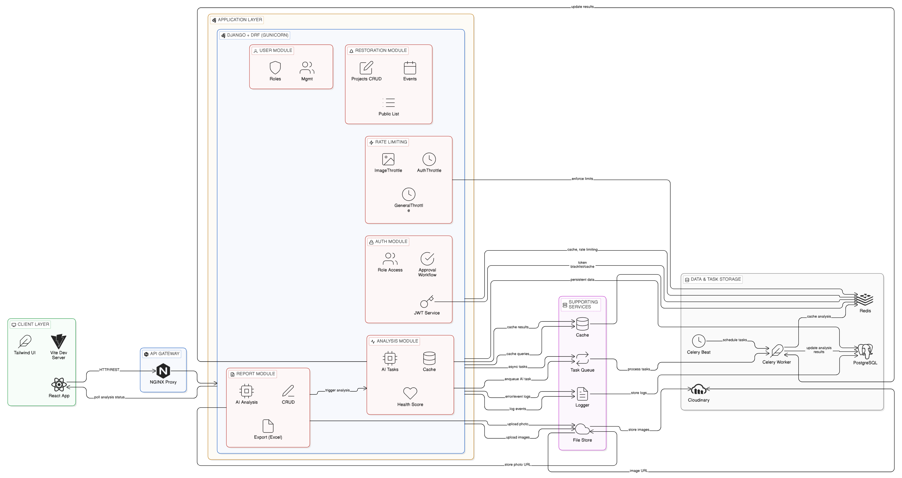

# 🌳 Mangrove Guardian AI

A comprehensive web platform for reporting, monitoring, and restoring mangrove ecosystems using AI-powered analysis and community engagement.

**Status:** Production-Ready | **Version:** 1.0.0

---

## 📋 Project Overview

Mangrove Guardian AI enables communities and organizations to:
- **Report mangrove damage** with geolocation and photographic evidence
- **Analyze damage** using AI inference to assess health scores and risk levels
- **Track restoration** projects and measure environmental impact
- **Collaborate** across community and organizational user roles

---

## 🏗️ Tech Stack

### Frontend
- **React 19** + TypeScript
- **Vite** for fast development & bundling
- **Tailwind CSS v4** for responsive UI with custom eco-theme
- **React Router** for navigation
- **React-Leaflet** for interactive maps
- **Axios** with JWT authentication

### Backend
- **Django 4.2.16 LTS** + Django REST Framework
- **Python 3.11**
- **Gunicorn WSGI** server (4 workers)
- **SimpleJWT** for token-based authentication
- **PostgreSQL 15** (production) / SQLite (development)

### Services & Infrastructure
- **Redis 7** for caching and rate limiting
- **Celery 5.3.4** for async task processing
- **Celery Beat** for scheduled jobs
- **Cloudinary** for image storage and CDN
- **Docker** with 6-service orchestration
- **Nginx** for production reverse proxy

---

## 🏛️ System Architecture



**Architecture Overview:**
- **Client Layer** - React 18 frontend with TypeScript and Tailwind CSS
- **API Gateway** - Nginx reverse proxy (production) with request routing
- **Application Layer** - Django REST API with rate limiting, JWT authentication, and role-based access
- **Services Layer** - Celery workers for async tasks, Redis cache, PostgreSQL database
- **Supporting Services** - Cloudinary CDN for image storage, logging infrastructure, monitoring

**Key Data Flows:**
1. **Report Submission** → Upload photo to Cloudinary → Store metadata in DB → Trigger Celery task → AI Analysis → Cache results
2. **Authentication** → Login with JWT → Store token → Add to headers → Automatic refresh → Role validation
3. **Rate Limiting** → Check Redis counter → Enforce 3-tier limits → Return 429 if exceeded → Display 15s notification

See [ARCHITECTURE.md](ARCHITECTURE.md) for comprehensive documentation including database schema, API endpoints, authentication flows, and deployment details.

---

## 📁 Project Structure

```
Mangrove-Guardian-AI/
├── Backend/                      # Django application
│   ├── config/                   # Project settings
│   ├── analysis/                 # AI analysis app (health scoring, risk assessment)
│   ├── reports/                  # Report submission & management
│   ├── restoration/              # Project & event tracking
│   ├── users/                    # Authentication & user management
│   ├── core/                     # Rate limiting & utilities
│   └── manage.py
│
├── Frontend/                     # React application
│   ├── src/
│   │   ├── pages/                # Landing, Auth, Dashboard, Reports, Restoration
│   │   ├── components/           # Reusable UI components
│   │   ├── api/                  # Axios client & endpoints
│   │   └── assets/               # Icons & styles
│   ├── package.json
│   └── vite.config.ts
│
├── docker-compose.yml            # Development environment
├── docker-compose.prod.yml       # Production environment
├── ARCHITECTURE.md               # Detailed system architecture
├── DOCKER.md                     # Docker deployment guide
├── DOCKER_QUICKSTART.md          # Quick start instructions
├── .env.example                   # Environment template
└── .env                          # Active environment file for Docker Compose

```

---

## 🚀 Quick Start

### Prerequisites
- Docker & Docker Compose
- Node.js 20+ (for local frontend development)
- Python 3.11+ (for local backend development)

### Development Setup (Docker)

```bash
# Clone the repository
git clone https://github.com/yourusername/Mangrove-Guardian-AI.git
cd Mangrove-Guardian-AI

# Create active environment file (docker compose reads .env by default)
cp .env.example .env

# Edit .env with your configuration
# (Database credentials, JWT secret, Cloudinary API keys, etc.)

# Build and start services
docker compose up -d

# Run migrations
docker compose exec backend python manage.py migrate

# Create superuser
docker compose exec backend python manage.py createsuperuser

# Collect static files
docker compose exec backend python manage.py collectstatic --noinput

# Access the application
# Frontend: http://localhost:5173
# Backend API: http://localhost:8000
# Admin: http://localhost:8000/admin
```

### Local Development (Without Docker)

**Backend:**
```bash
cd Backend
python -m venv venv
source venv/bin/activate  # On Windows: venv\Scripts\activate
pip install -r requirements.txt
python manage.py migrate
python manage.py runserver
```

**Frontend:**
```bash
cd Frontend
npm install
npm run dev
```

---

## 📚 Documentation

- **[Architecture Documentation](ARCHITECTURE.md)** - Comprehensive system design, database schema, API endpoints
- **[Docker Guide](DOCKER.md)** - Complete Docker setup, services, health checks, troubleshooting
- **[Quick Start Guide](DOCKER_QUICKSTART.md)** - Fast setup for developers

---

## 🔐 Key Features

### User Roles
1. **Community Users** - Report damage, upload photos, view AI analysis
2. **Organization Users** - Review all reports, verify data, track restoration, export analytics

### Rate Limiting (3-Tier)
- **Authentication**: 5 requests/minute
- **Image Analysis**: 20 requests/day
- **General API**: 100 requests/hour

### Authentication
- JWT tokens with 15-minute expiry
- Automatic token refresh
- Role-based access control (RBAC)

### AI Analysis
- Health score calculation (0-100)
- Damage detection (binary classification)
- Risk level assessment (low/medium/high)
- Async processing with Celery

---

## 🗄️ Database Models

| Model | Purpose |
|-------|---------|
| **User** | Authentication, roles, organization affiliation |
| **Report** | Mangrove damage submissions with location & photos |
| **Analysis** | AI analysis results (health score, damage, risk) |
| **RestorationProject** | Restoration initiatives tracking |
| **RestorationEvent** | Individual restoration activities & metrics |

---

## 🔌 API Endpoints (Core)

### Authentication
- `POST /api/token/` - Login with credentials
- `POST /api/register/` - Create new account
- `POST /api/token/refresh/` - Refresh access token

### Reports
- `GET /api/reports/` - List all reports (paginated)
- `POST /api/reports/` - Submit new report
- `GET /api/reports/:id/` - Report details
- `PUT /api/reports/:id/` - Update report
- `DELETE /api/reports/:id/` - Delete report
- `GET /api/reports/export/` - Export reports as XLSX

### Analysis
- `GET /api/analysis/` - List analyses
- `POST /api/analysis/` - Trigger AI analysis
- `GET /api/analysis/:id/` - Analysis details

### Restoration
- `GET /api/projects/` - List restoration projects
- `POST /api/projects/` - Create project
- `POST /api/events/` - Log restoration event

---

## 🐳 Docker Services

Development environment includes:
- **PostgreSQL 15** - Main database (port 5432)
- **Redis 7** - Cache & Celery broker (port 6379)
- **Django** - REST API (port 8000)
- **Celery Worker** - Async tasks
- **Celery Beat** - Scheduled jobs
- **React Dev Server** - Frontend (port 5173)

Production adds:
- **Nginx** - Reverse proxy with SSL (ports 80/443)
- **Gunicorn** with threads for Django
- **Persistent volumes** for data

---

## 🛠️ Development Workflow

### Backend Development
```bash
cd Backend
python manage.py makemigrations
python manage.py migrate
python manage.py runserver
```

### Frontend Development
```bash
cd Frontend
npm run dev      # Vite dev server with hot reload
npm run build    # Production build
npm run lint     # ESLint check
```

### Running Tests
```bash
# Backend tests
cd Backend
python manage.py test

# Frontend tests
cd Frontend
npm test
```

---

## 📊 Error Handling

The application implements comprehensive error handling:
- **429 (Rate Limited)** - User sees 15-second notification with countdown
- **401 (Unauthorized)** - Redirect to login after token expiry
- **500 (Server Error)** - Global error boundary with user-friendly messages
- **Axios interceptors** capture all errors and route to notification system

---

## 🔧 Configuration

### Environment Variables (.env)

```env
# Django
DEBUG=False
SECRET_KEY=your-secret-key
ALLOWED_HOSTS=localhost,127.0.0.1,backend
REQUIRE_ORG_APPROVAL=False

# Database
DB_ENGINE=django.db.backends.postgresql
DB_NAME=Mangrove
DB_USER=postgres
DB_PASSWORD=postgres
DB_HOST=db
DB_PORT=5432

# Redis
REDIS_URL=redis://redis:6379/1
CELERY_BROKER_URL=redis://redis:6379/1
CELERY_RESULT_BACKEND=redis://redis:6379/1

# Cloudinary
CLOUDINARY_CLOUD_NAME=your-cloud-name
CLOUDINARY_API_KEY=your-api-key
CLOUDINARY_API_SECRET=your-api-secret

# Frontend
VITE_API_URL=http://localhost:8000/api
VITE_APP_NAME=Mangrove Guardian AI
```

---

## 🚢 Deployment

### Production Deployment (Docker Compose)
```bash
# Use production compose file
docker compose -f docker-compose.prod.yml up -d

# Enable SSL with reverse proxy
# Configure Nginx for HTTPS
```

### Production Environment Setup

```bash
# Create production env file from template
cp .env.production.example .env

# Edit .env with real production secrets before deploy
# Required: SECRET_KEY, DB_PASSWORD, REDIS_PASSWORD,
# CLOUDINARY_*, FEATHERLESS_API_KEY, ALLOWED_HOSTS, CORS_ALLOWED_ORIGINS

# Start production stack
docker compose -f docker-compose.prod.yml up -d --build
```

### Production Security Checklist

1. `DEBUG=False` in `.env`
2. Strong unique `SECRET_KEY`, `DB_PASSWORD`, and `REDIS_PASSWORD`
3. Restrictive `ALLOWED_HOSTS` and `CORS_ALLOWED_ORIGINS` for your domain only
4. Valid TLS certificates mounted under `./ssl` (for HTTPS/443)
5. Rotate any previously exposed keys before deployment
6. Keep `.env` out of source control

See [Docker Guide](DOCKER.md) for detailed production setup.

---

## 🤝 Contributing

1. Create feature branch: `git checkout -b feature/your-feature`
2. Commit changes: `git commit -m "Add your feature"`
3. Push to branch: `git push origin feature/your-feature`
4. Open Pull Request

### Code Style
- Backend: PEP 8 with black formatter
- Frontend: ESLint + Prettier

---

## 📝 License

This project is licensed under the MIT License - see LICENSE file for details.

---

## 📧 Support

For issues, questions, or suggestions:
- Open an issue on GitHub
- Check [Architecture Documentation](ARCHITECTURE.md) for technical details
- Review [Docker Guide](DOCKER.md) for deployment issues

---

## 🌍 About Mangroves

Mangrove forests are vital ecosystems that:
- Protect coastal communities from storms and flooding
- Filter saltwater and provide nurseries for marine life
- Store more carbon than any other forest type
- Support millions of people worldwide

**Mangrove Guardian AI** helps communities monitor and restore these critical ecosystems through technology and collaboration.

---

**Built with ❤️ for environmental conservation**
