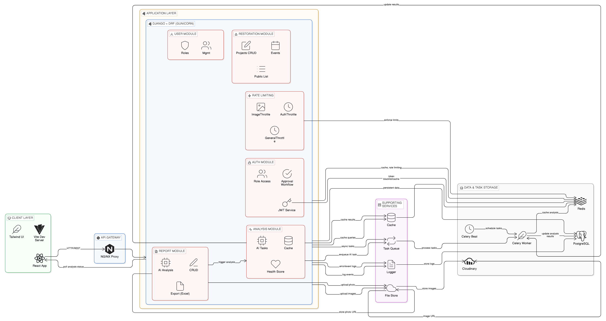

# 🌳 Mangrove Guardian AI

**Community-powered mangrove monitoring with AI damage assessment.**

Mangrove Guardian AI lets coastal communities report damaged mangroves with a photo and a location. A multimodal AI model scores the ecosystem's health. Conservation organizations use the same platform to review reports, plan restoration projects, and track trees planted.

🎥 **Demo video:** https://youtu.be/aZBV_R53PRY


---

## 📋 Table of Contents

- [Why It Matters](#-why-it-matters)
- [Features](#-features)
- [How the AI Analysis Works](#-how-the-ai-analysis-works)
- [Architecture](#️-architecture)
- [Tech Stack](#️-tech-stack)
- [Getting Started](#-getting-started)
- [Configuration](#-configuration)
- [API Reference](#-api-reference)
- [Data Model](#️-data-model)
- [Rate Limiting and Caching](#️-rate-limiting-and-caching)
- [Deployment](#-deployment)
- [Project Structure](#-project-structure)
- [Documentation](#-documentation)
- [Contributing](#-contributing)
- [License](#-license)

---

## 🌍 Why It Matters

Mangrove forests protect coastlines from storms and flooding, and they are nurseries for marine life. They also store more carbon per hectare than most other forests. Damage often goes unreported until it is severe, because monitoring large coastal areas is expensive.

Mangrove Guardian AI turns local communities into a monitoring network. It gives organizations a fast, AI-assisted first assessment of every report.

---

## ✨ Features

### For community members
- **Report damage** with a photo, a description, and a location picked on an interactive map (Leaflet)
- **Get an AI assessment** of each report: health score (0–100), damage detected (yes/no), risk level (low/medium/high), and a short explanation
- **Follow progress** live while the analysis runs, and retry a failed analysis

### For organizations
- **Review all reports** on a map and in a dashboard
- **Export reports** to Excel (`.xlsx`)
- **Manage restoration projects** (planned, ongoing, completed) and log restoration events with the number of trees planted
- **Admin approval** for organization accounts (optional, `REQUIRE_ORG_APPROVAL`)

### For the public
- **Landing page** that lists completed restoration projects (no login needed)

---

## 🤖 How the AI Analysis Works

Analysis runs in the background, so the API responds at once and the UI polls for the result.

```
Report submitted ──▶ POST /api/analysis/ ──▶ Analysis row (status: pending)
                                                   │
                                   transaction.on_commit
                                                   ▼
                                  Celery task: analyze_report_image
                                                   │
                     Photo URL (Cloudinary) + description sent to
                     Gemma 3 12B (multimodal) via Featherless AI
                                                   │
                     JSON extracted ─▶ normalized ─▶ validated (Pydantic)
                                                   ▼
                                  Analysis row (status: complete)
```

Reliability features in [`Backend/analysis/tasks.py`](Backend/analysis/tasks.py):

- **Strict output schema.** Pydantic validates the model response: `health_score` from 0 to 100, `damage_detected` as a boolean, `risk_level` as `low`, `medium`, or `high`, and `result` as text.
- **Output normalization.** The task extracts JSON from plain or fenced model output and converts values to the right types before validation.
- **Automatic retries.** Timeouts, connection errors, and provider errors retry with exponential backoff (30 s up to 15 min, maximum 8 retries).
- **Refusal detection.** The task detects replies where the model says it cannot see the image, and treats them as failures.
- **Optional degraded mode.** With `ANALYSIS_ALLOW_DEGRADED_FALLBACK=True`, a keyword heuristic gives a provisional score when the AI provider is down. The result is clearly marked as provisional.
- **Queue safety.** The task is queued only after the database transaction commits. If the queue is unavailable, the analysis is marked `failed` with a clear message.

---

## 🏛️ Architecture



| Layer | Components |
|-------|------------|
| **Client** | React 19 + TypeScript + Tailwind CSS, served by Vite (development) or Vercel/Nginx (production) |
| **Gateway** | Nginx reverse proxy with TLS (production) |
| **API** | Django REST Framework on Gunicorn: JWT authentication, role-based access, rate limiting |
| **Workers** | Celery worker (AI analysis), Celery Beat (scheduled jobs) |
| **Data** | PostgreSQL (primary data), Redis (cache, throttle counters, Celery broker) |
| **External** | Cloudinary (image storage and CDN), Featherless AI (LLM inference) |

For the database schema, authentication flow, and deployment diagrams, see [ARCHITECTURE.md](ARCHITECTURE.md).

---

## 🏗️ Tech Stack

| Area | Technology |
|------|------------|
| Frontend | React 19, TypeScript, Vite, Tailwind CSS v4, React Router 7, React-Leaflet, Axios, jwt-decode |
| Backend | Python 3.11, Django 4.2 LTS, Django REST Framework, SimpleJWT, django-filter |
| Async | Celery 5.3, Celery Beat (`django-celery-beat`), Redis 7 |
| Database | PostgreSQL 15 |
| AI | Featherless AI (OpenAI-compatible API), Gemma 3 12B instruction-tuned model, Pydantic |
| Storage | Cloudinary |
| Infrastructure | Docker Compose, Gunicorn, Nginx, WhiteNoise, Vercel (frontend) |

---

## 🚀 Getting Started

### Prerequisites

- Docker and Docker Compose
- A [Cloudinary](https://cloudinary.com/) account (free tier is enough)
- A [Featherless AI](https://featherless.ai/) API key
- Optional, for development without Docker: Python 3.11+, Node.js 20+, PostgreSQL, and Redis

### Option A: Docker (recommended)

```bash
git clone https://github.com/moatazbenma/Mangrove-Guardian-AI.git
cd Mangrove-Guardian-AI

# Create the environment file that Docker Compose reads
cp .env.example .env
```

Edit `.env` and set at least `SECRET_KEY`, the `CLOUDINARY_*` values, and `FEATHERLESS_API_KEY`. Docker Compose does not start without `FEATHERLESS_API_KEY`.

```bash
docker compose up -d --build

# Create an admin account
docker compose exec backend python manage.py createsuperuser
```

The backend container runs migrations and `collectstatic` automatically when it starts.

| Service | URL |
|---------|-----|
| Frontend | http://localhost:5173 |
| API | http://localhost:8000/api |
| Django admin | http://localhost:8000/admin |

Helper scripts are also available: `./docker-setup.sh` (macOS/Linux) or `docker-setup.bat` (Windows).

### Option B: Local development without Docker

Start PostgreSQL and Redis first.

**Backend**

```bash
cd Backend
python -m venv venv
source venv/bin/activate        # Windows: venv\Scripts\activate
pip install -r requirements.txt
cp .env.example .env            # then edit the values
python manage.py migrate
python manage.py runserver
```

**Celery worker** (in a second terminal, from `Backend/`)

```bash
celery -A config worker --loglevel=info
# Windows: add --pool=solo
```

To skip Celery during development, set `ANALYSIS_FORCE_SYNC=True`. Analysis then runs inside the API request.

**Frontend** (in a third terminal)

```bash
cd Frontend
npm install
npm run dev
```

---

## 🔧 Configuration

Templates: [`.env.example`](.env.example) (Docker), [`Backend/.env.example`](Backend/.env.example) (local), and [`.env.production.example`](.env.production.example) (production).

| Variable | Purpose | Example |
|----------|---------|---------|
| `SECRET_KEY` | Django secret key | a long random string |
| `DEBUG` | Debug mode | `False` |
| `ALLOWED_HOSTS` | Hosts Django accepts | `localhost,127.0.0.1,backend` |
| `CORS_ALLOWED_ORIGINS` | Frontend origins | `http://localhost:5173` |
| `DB_NAME`, `DB_USER`, `DB_PASSWORD`, `DB_HOST`, `DB_PORT` | PostgreSQL connection | `Mangrove`, `postgres`, …, `db`, `5432` |
| `REDIS_URL` | Cache and throttle storage | `redis://redis:6379/1` |
| `CELERY_BROKER_URL`, `CELERY_RESULT_BACKEND` | Celery | `redis://redis:6379/1` |
| `CLOUDINARY_CLOUD_NAME`, `CLOUDINARY_API_KEY`, `CLOUDINARY_API_SECRET` | Image storage | from the Cloudinary dashboard |
| `FEATHERLESS_API_KEY` | AI inference (**required**) | from the Featherless dashboard |
| `FEATHERLESS_TIMEOUT_SECONDS` | AI request timeout | `45` |
| `REQUIRE_ORG_APPROVAL` | Organization accounts need admin approval | `False` |
| `ANALYSIS_ALLOW_DEGRADED_FALLBACK` | Heuristic score when AI is down | `False` |
| `ANALYSIS_FORCE_SYNC` | Run analysis without Celery | `False` |
| `VITE_API_URL` | API base URL for the frontend | `http://localhost:8000/api` |

---

## 🔌 API Reference

All endpoints are under `/api/`. Send `Authorization: Bearer <access_token>` unless the endpoint is marked public.

### Authentication

| Method | Endpoint | Description |
|--------|----------|-------------|
| POST | `/register/` | Create an account (`community` or `organization` role). Public |
| POST | `/token/` | Log in and get `access` and `refresh` tokens. Public |
| POST | `/token/refresh/` | Get a new access token. Public |

### Reports

| Method | Endpoint | Description |
|--------|----------|-------------|
| GET | `/reports/` | List reports (community: own reports; approved organization: all reports) |
| POST | `/reports/` | Submit a report (`multipart/form-data` with photo) |
| GET / PUT / PATCH / DELETE | `/reports/{id}/` | Manage a report |
| GET | `/reports/export/` | Download reports as `.xlsx` |

### Analysis

| Method | Endpoint | Description |
|--------|----------|-------------|
| GET | `/analysis/` | List analyses |
| POST | `/analysis/` | Start an analysis: `{ "report": <id> }` |
| GET | `/analysis/{id}/` | Get status and result |
| POST | `/analysis/{id}/retry/` | Queue a failed analysis again |

### Restoration

| Method | Endpoint | Description |
|--------|----------|-------------|
| GET / POST | `/projects/` | List or create restoration projects |
| GET / PUT / PATCH / DELETE | `/projects/{id}/` | Manage a project |
| GET | `/projects/completed-public/` | Completed projects. Public |
| GET / POST | `/events/` | List or log restoration events |

Tokens: access tokens last 1 hour, refresh tokens last 7 days. The frontend refreshes access tokens automatically.

---

## 🗄️ Data Model

```
User ──< Report ──── Analysis (one-to-one)
  │
  └──< RestorationProject ──< RestorationEvent
```

| Model | Key fields |
|-------|------------|
| **User** | `role` (`community` / `organization`), `is_approved` |
| **Report** | `photo` (Cloudinary), `description`, `location`, `lat`, `lng`, `date_submitted` |
| **Analysis** | `health_score`, `damage_detected`, `risk_level`, `result`, `status` (`pending` / `processing` / `complete` / `failed`) |
| **RestorationProject** | `name`, `location`, `lat`, `lng`, `start_date`, `end_date`, `status` (`planned` / `ongoing` / `completed`) |
| **RestorationEvent** | `project`, `trees_planted`, `date`, `description` |

---

## 🛡️ Rate Limiting and Caching

Rate limits use DRF throttles backed by Redis ([`Backend/core/throttles.py`](Backend/core/throttles.py)):

| Scope | Limit | Applies to |
|-------|-------|------------|
| `auth` | 5 / minute | Login and registration |
| `image_analysis` | 20 / day per user | AI analysis |
| `general` | 100 / hour per user | Reports, projects, events |
| `anon` | 50 / hour per IP | Unauthenticated requests |

- When a limit is exceeded, the API returns **429** and the UI shows a countdown notification.
- Throttles **fail open**: if Redis is unavailable, requests still go through instead of returning 500.
- List endpoints cache results in Redis for 5 minutes. Writes invalidate the cache. Detail endpoints are never cached, so new records are visible at once.

---

## 🚢 Deployment

```bash
cp .env.production.example .env     # fill in real secrets
docker compose -f docker-compose.prod.yml up -d --build
```

The production stack adds Nginx with TLS (certificates mounted under `./ssl`) and persistent volumes. The frontend can also be deployed to Vercel (`Frontend/vercel.json`).

**Production checklist**

- [ ] `DEBUG=False`
- [ ] Strong, unique `SECRET_KEY`, `DB_PASSWORD`, and `REDIS_PASSWORD`
- [ ] `ALLOWED_HOSTS` and `CORS_ALLOWED_ORIGINS` limited to your domain
- [ ] Valid TLS certificates in `./ssl`
- [ ] Rotate any keys that were ever committed or shared
- [ ] `.env` is not in source control

See [DOCKER.md](DOCKER.md) for the full guide.

---

## 📁 Project Structure

```
Mangrove-Guardian-AI/
├── Backend/
│   ├── config/          # Settings, URLs, Celery app
│   ├── users/           # Custom user model, registration, JWT login
│   ├── reports/         # Report CRUD and Excel export
│   ├── analysis/        # AI analysis: Celery task, retries, validation
│   ├── restoration/     # Restoration projects and events
│   ├── core/            # Throttles (rate limiting)
│   ├── Dockerfile
│   └── requirements.txt
├── Frontend/
│   └── src/
│       ├── pages/       # Landing, auth, dashboard, report form, restoration
│       ├── components/  # Analysis progress/results, map, cards, notifications
│       ├── hooks/       # useAuth, useReports, useDashboard, useAnalysisPoller
│       ├── api/         # Axios client with JWT interceptors
│       └── services/
├── docker-compose.yml        # Development stack
├── docker-compose.prod.yml   # Production stack
├── nginx.conf
└── ARCHITECTURE.md
```

---

## 📚 Documentation

- [ARCHITECTURE.md](ARCHITECTURE.md): system design, database schema, and data flows
- [DOCKER.md](DOCKER.md): Docker services, health checks, and troubleshooting
- [DOCKER_QUICKSTART.md](DOCKER_QUICKSTART.md): fast setup
- [CONTRIBUTING.md](CONTRIBUTING.md): contribution guidelines

---

## 🛠️ Development Commands

```bash
# Backend
cd Backend
python manage.py makemigrations
python manage.py migrate
python manage.py test
black . && flake8

# Frontend
cd Frontend
npm run dev       # dev server with hot reload
npm run build     # type-check and production build
npm run lint      # ESLint
```

---

## 🤝 Contributing

1. Fork the repository and create a branch: `git checkout -b feature/your-feature`
2. Commit your changes: `git commit -m "Add your feature"`
3. Push the branch: `git push origin feature/your-feature`
4. Open a pull request

Code style: PEP 8 with `black` and `flake8` for the backend, ESLint for the frontend. See [CONTRIBUTING.md](CONTRIBUTING.md).

---

## 📝 License

This project uses the MIT License. See [LICENSE](LICENSE).

---

**Built with 💚 for coastal ecosystems and the communities that protect them.**
